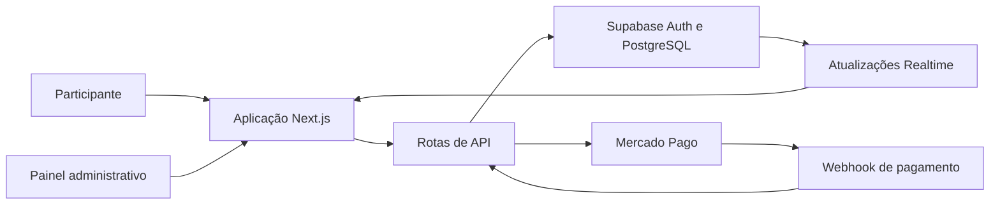

# Super Palpite

Plataforma full-stack demonstrativa para gerenciamento de bolões de placar exato, com painel administrativo, pagamentos Pix, apuração de resultados e controle financeiro.

> **Projeto de portfólio:** esta aplicação foi desenvolvida para demonstrar conhecimentos em engenharia de software, TypeScript, Next.js, PostgreSQL, autenticação, integrações, segurança e deploy com Docker.
>
> O ambiente publicado utiliza somente dados fictícios e não representa uma operação comercial de apostas.

## Screenshots

### Página inicial


### Painel administrativo


## Demonstração

- Aplicação: [https://superpalpite.com](https://superpalpite.com)
- Painel administrativo: [https://superpalpite.com/admin/dashboard](https://superpalpite.com/admin/dashboard)
- Código-fonte: [https://github.com/renylson/superpalpite](https://github.com/renylson/superpalpite)

### Conta de demonstração

```text
E-mail: teste@superpalpite.com
Senha: Teste@123
Perfil: viewer
```

> Esta conta é destinada exclusivamente à demonstração do portfólio e utiliza o perfil `viewer`. O ambiente deve conter somente dados fictícios. Não utilize essa credencial em outros serviços ou ambientes.
>
> A integração de pagamento deve ser utilizada somente em ambiente de testes. Credenciais administrativas reais e segredos da aplicação não fazem parte do repositório.

## Visão geral

O Super Palpite centraliza o fluxo completo de um bolão esportivo:

1. o administrador cadastra uma competição e uma partida;
2. cria um bolão com valor do bilhete e regras de premiação;
3. o participante informa seus dados e seu palpite;
4. a aplicação gera uma cobrança Pix;
5. o backend consulta e valida o pagamento;
6. os valores financeiros do bolão são recalculados;
7. após a partida, o resultado é publicado;
8. o sistema identifica os vencedores e divide o prêmio.

O projeto foi criado para praticar não apenas desenvolvimento de interfaces, mas também regras de negócio, persistência de dados, autenticação, autorização, integrações externas, segurança e operação em containers.

## Funcionalidades

### Área pública

- listagem de bolões abertos e encerrados;
- seleção de placar;
- cadastro de participante;
- geração de pagamento Pix;
- acompanhamento do status do pagamento;
- visualização pública de palpites confirmados;
- geração de comprovante individual;
- regulamento, FAQ e instruções de participação;
- atualização de informações em tempo real.

### Painel administrativo

- dashboard operacional e financeiro;
- gerenciamento de competições e jogos;
- criação e gerenciamento de bolões;
- consulta de bilhetes, palpites e pagamentos;
- gerenciamento de participantes;
- lançamento de resultados;
- identificação e divisão do prêmio entre vencedores;
- controle de entradas e saídas;
- exportação de informações;
- gerenciamento de usuários administrativos.

## Tecnologias

### Aplicação

- Next.js com App Router;
- React;
- TypeScript;
- Tailwind CSS;
- Zod;
- Vitest.

### Dados e autenticação

- PostgreSQL;
- Supabase Auth;
- Supabase Row Level Security;
- Supabase Realtime.

### Integrações e infraestrutura

- Mercado Pago Pix;
- Docker;
- Docker Compose;
- Nginx Proxy Manager.

## Arquitetura



A aplicação utiliza o Next.js tanto para renderização das páginas quanto para os endpoints de backend.

As operações públicas devem utilizar somente os dados necessários para apresentação dos bolões. Operações administrativas e integrações privadas são executadas no servidor.

## Regras de negócio

Algumas regras implementadas no projeto:

- o palpite fecha 30 minutos antes do início da partida;
- o valor do bilhete é armazenado como snapshot;
- taxa administrativa e contribuição para o prêmio são calculadas separadamente;
- pagamentos com valor divergente são rejeitados;
- somente pagamentos aprovados participam da apuração;
- o prêmio é dividido igualmente entre os acertadores;
- o sistema mantém um prêmio mínimo configurado para o bolão;
- cada palpite aprovado recebe um comprovante;
- resultados atualizam a situação dos palpites e vencedores.

O uso de snapshots evita que uma alteração posterior no valor do bolão modifique registros financeiros criados anteriormente.

## Autenticação e autorização

O painel utiliza autenticação do Supabase e possui dois papéis planejados:

| Papel | Permissões |
|---|---|
| `admin` | Visualização e operações administrativas |
| `viewer` | Visualização limitada de dados demonstrativos |

A autorização deve ser validada no backend independentemente dos controles exibidos na interface.

> O modelo de permissões está sendo revisado para aplicar o princípio de menor privilégio em todas as páginas, APIs e políticas do banco. A credencial `viewer` publicada dá acesso somente ao ambiente demonstrativo com dados fictícios e não deve ser reutilizada em outros sistemas.

## Segurança

### Implementado

- segredos mantidos no ambiente do servidor;
- validação de payloads com Zod;
- consulta do pagamento diretamente no provedor;
- comparação entre valor recebido e valor esperado;
- execução do container como usuário sem privilégios;
- views públicas com conjunto reduzido de colunas.

### Em evolução

- autorização server-side em todas as páginas administrativas;
- matriz de permissões dos perfis `admin` e `viewer`;
- revisão completa das políticas RLS;
- validação HMAC do webhook;
- idempotência transacional de pagamentos;
- rate limiting compartilhado entre instâncias.

## Testes e qualidade

Atualmente, os testes automatizados cobrem as principais regras financeiras:

- cálculo da taxa administrativa;
- cálculo da contribuição para o prêmio;
- prêmio mínimo;
- crescimento do prêmio acumulado;
- divisão entre vencedores.

```bash
cd app
npm install
npm run test
npm run lint
npm run build
```

Próximos testes planejados:

- autenticação e permissões;
- bloqueio de escrita para o perfil `viewer`;
- políticas RLS;
- assinatura do webhook;
- idempotência de pagamentos;
- processamento concorrente;
- apuração de resultados;
- aplicação das migrations em um banco vazio.

## Execução local

### Requisitos

- Node.js 22 ou superior;
- Docker e Docker Compose;
- projeto no Supabase;
- credenciais de teste do Mercado Pago.

### Configuração

```bash
git clone https://github.com/renylson/superpalpite.git
cd superpalpite
cp .env.example .env
```

Preencha as variáveis necessárias no `.env`:

```env
# Supabase
NEXT_PUBLIC_SUPABASE_URL=
NEXT_PUBLIC_SUPABASE_ANON_KEY=
SUPABASE_SERVICE_ROLE_KEY=

# Mercado Pago
MERCADO_PAGO_ACCESS_TOKEN=
MERCADO_PAGO_WEBHOOK_SECRET=

# Aplicação
NEXT_PUBLIC_APP_URL=
CRON_SECRET=
```

Nunca utilize credenciais reais em commits ou exemplos públicos.

### Desenvolvimento

```bash
cd app
npm install
npm run dev
```

A aplicação estará disponível em:

```text
http://localhost:3000
```

### Docker

Na raiz do projeto:

```bash
docker compose build
docker compose up -d
```

Por padrão, o Docker Compose publica a aplicação na porta `3010`:

```text
http://localhost:3010
```

## Decisões técnicas

### Supabase

Foi escolhido para reunir PostgreSQL, autenticação, RLS e atualizações em tempo real, mantendo um banco relacional e permitindo aplicar políticas de acesso próximas aos dados.

### Next.js App Router

Permite manter interface e endpoints no mesmo projeto, simplificando o deploy da demonstração e possibilitando o compartilhamento de tipos e regras de validação.

### Snapshots financeiros

Valores importantes são registrados no momento da criação do palpite. Isso preserva o histórico caso as configurações do bolão sejam alteradas posteriormente.

### Docker multi-stage

O build utiliza múltiplos estágios e a saída standalone do Next.js. O container final executa como usuário sem privilégios e contém somente os arquivos necessários para execução.

## Estrutura do projeto

```text
superpalpite/
├── app/
│   ├── public/
│   ├── src/
│   │   ├── app/
│   │   │   ├── admin/
│   │   │   └── api/
│   │   ├── components/
│   │   ├── hooks/
│   │   ├── lib/
│   │   └── types/
│   ├── supabase/
│   ├── Dockerfile
│   └── package.json
├── supabase/
│   └── migrations/
├── docker-compose.yml
└── README.md
```

## Roadmap

- [ ] concluir o RBAC de `admin` e `viewer`;
- [ ] consolidar as migrations do Supabase;
- [ ] ampliar os testes de integração;
- [ ] tornar pagamentos idempotentes e transacionais;
- [ ] adicionar GitHub Actions;
- [ ] implementar logs estruturados e observabilidade;
- [ ] adicionar healthcheck ao Docker Compose;
- [ ] revisar dependências automaticamente;
- [ ] documentar o modelo de dados e o modelo de ameaças.

## O que aprendi

Este projeto permitiu aprofundar conhecimentos em:

- modelagem de regras financeiras;
- desenvolvimento full-stack com TypeScript;
- autenticação e autorização;
- integração com APIs de pagamento;
- webhooks e idempotência;
- PostgreSQL e políticas RLS;
- proteção de dados pessoais;
- containers e deploy;
- testes e documentação técnica.

O desenvolvimento também reforçou uma prática importante: uma funcionalidade estar funcionando na interface não significa que esteja segura. Autorização, concorrência, privacidade e tratamento de falhas precisam ser verificados separadamente.

## Contexto do autor

Sou profissional de telecomunicações e infraestrutura, com experiência em redes, Linux, servidores, virtualização, Docker, monitoramento e ambientes de provedores de internet.

Estou direcionando essa experiência operacional para desenvolvimento de software, automação, backend e DevOps. O Super Palpite demonstra minha capacidade de transformar regras de negócio em uma aplicação funcional e, principalmente, de analisar suas limitações e evoluí-la com critérios de engenharia.

## Aviso legal

Este repositório possui finalidade educacional e demonstrativa.

Antes de qualquer utilização comercial envolvendo pagamentos, premiações ou eventos esportivos, seria necessária uma avaliação jurídica, regulatória, contábil e de proteção de dados adequada ao contexto de operação.

## Autor

**Renylson Marques**

- GitHub: [github.com/renylson](https://github.com/renylson)
- LinkedIn: [linkedin.com/in/renylsonmarques/](https://www.linkedin.com/in/renylsonmarques/)
